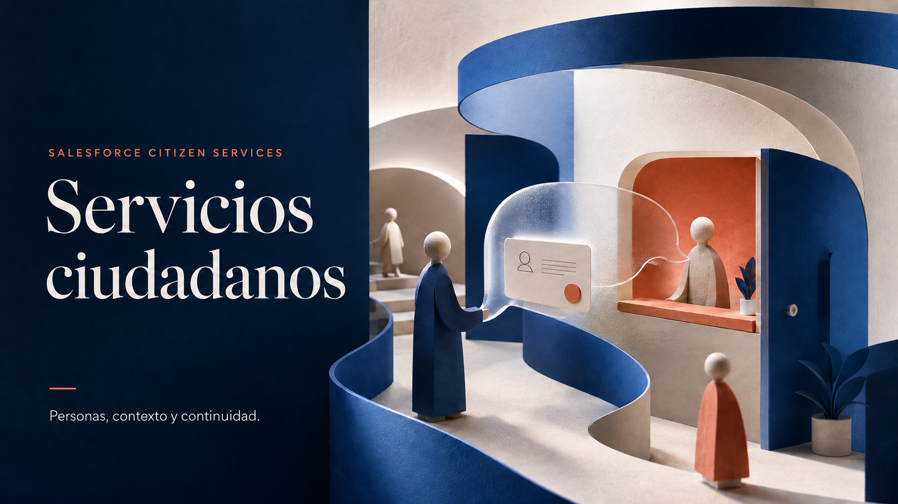

# Servicios ciudadanos asistidos



Un punto de partida para pilotos de atención ciudadana sobre Salesforce: explicar el estado de un trámite, señalar documentos pendientes y preparar una derivación a un funcionario con contexto.

El valor para una entidad es reducir consultas repetitivas y evitar que la persona tenga que reconstruir su historia en cada canal. El piloto debe medir ese resultado; este repositorio no atribuye ahorros, cobertura ni resultados productivos que todavía no se han medido.

## Qué se puede revisar hoy

- **Portal LWC existente:** interfaz de consulta, ruta del trámite, documentos, conversación ilustrativa y preguntas frecuentes. Conserva su diseño original. Trabaja con datos ficticios locales y no llama a un backend.
- **Agentforce:** instrucciones de alcance, manejo de ambigüedad y derivación, extraídas como referencia legible. Su identidad técnica original se conserva donde afecta referencias internas. El archivo no es un paquete listo para desplegar en otra organización.
- **MuleSoft:** tres contratos OpenAPI —System, Process y Experience— y un flujo System preliminar para un adaptador Oracle/legacy. Incluye SQL de demostración y esqueletos MUnit.
- **Documentación:** límites de la implementación, arquitectura actual y propuesta, plan de piloto, procedencia y procedimiento de verificación.

**Estado: demostración local y diseño de integración.** No hay evidencia en este repositorio de un runtime Mule ejecutado ni de una cadena Agentforce→Mule→sistema de registro funcionando. En la comprobación pública del 7 de septiembre de 2026, la URL de consulta mostró preparación y después un mensaje de error de Salesforce; el portal no quedó confirmado operativo. Las referencias históricas se distinguen de verificaciones actuales en [estado de evidencia](docs/evidence/status.md).

## Caso de uso para un piloto

Empezar con un solo trámite y un equipo humano: consultar requisitos con referencia a su fuente, explicar un estado autorizado, preparar una solicitud y enviarla a revisión tras confirmación del ciudadano. La persona responsable decide su aceptación; el asistente no concede beneficios ni modifica criterios de elegibilidad.

La interfaz de hoy representa parte de ese recorrido. La creación de solicitudes, recuperación documental con citas, autorización real y bandeja de revisión son trabajo pendiente, descrito en [plan de piloto](docs/pilot.md).

## Revisión rápida

```bash
python3 scripts/validate_local.py
```

El control necesita Python 3 y PyYAML. Verifica sintaxis XML/JSON/YAML, referencias locales de los contratos y reglas de consistencia específicas. No instala paquetes, no se conecta a Salesforce y no ejecuta Mule. Si falta PyYAML, informa el bloqueo y devuelve error.

Para entender cómo inspeccionar el componente y qué hace falta para una prueba en un entorno autorizado, sigue el [runbook](docs/runbook.md). Para evaluar un piloto o un acompañamiento de consultoría, utiliza el [alcance y criterios de aceptación](docs/pilot.md).

## Mapa del repositorio

| Carpeta | Contenido |
|---|---|
| `force-app/` | Componente LWC y su metadata |
| `salesforce/agentforce/` | AgentScript de referencia sanitizado |
| `mulesoft/` | Contratos, flujo preliminar, ejemplos de configuración y SQL ficticio |
| `docs/base/` | Conocimiento técnico recuperado del trabajo anterior |
| `docs/architecture.md` | Implementación actual y arquitectura objetivo Salesforce |
| `docs/pilot.md` | Propuesta de un piloto acotado para una entidad |
| `docs/evidence/` | Estado y resultado de comprobaciones locales |
| `docs/provenance/` | Fuentes, hashes, transformaciones y exclusiones |

Salesforce, Agentforce, Experience Cloud y MuleSoft identifican las tecnologías del proyecto. Este trabajo es independiente y no acredita patrocinio, certificación, vínculo comercial ni carácter oficial gubernamental. No se otorgan aquí derechos sobre software o marcas de terceros; consulta las [notas de procedencia](docs/provenance/README.md).

## Conversar sobre un piloto

El [plan de piloto](docs/pilot.md) propone alcance y criterios de aceptación.
Puedes contactar a Sebastián Jaramillo desde su [perfil de GitHub](https://github.com/sjaramillov)
para adaptar la demostración a un proceso concreto. [Autoría y condiciones de uso](NOTICE.md).

## Arquitectura visual

La [galería del proyecto](docs/visuals/README.md) reúne la portada, la arquitectura de solución y la revisión de Salesforce Well-Architected. Los diagramas identifican los componentes existentes y el diseño propuesto, con fuentes oficiales y evidencia del proyecto. Incluyen PNG para compartir y SVG editables.
