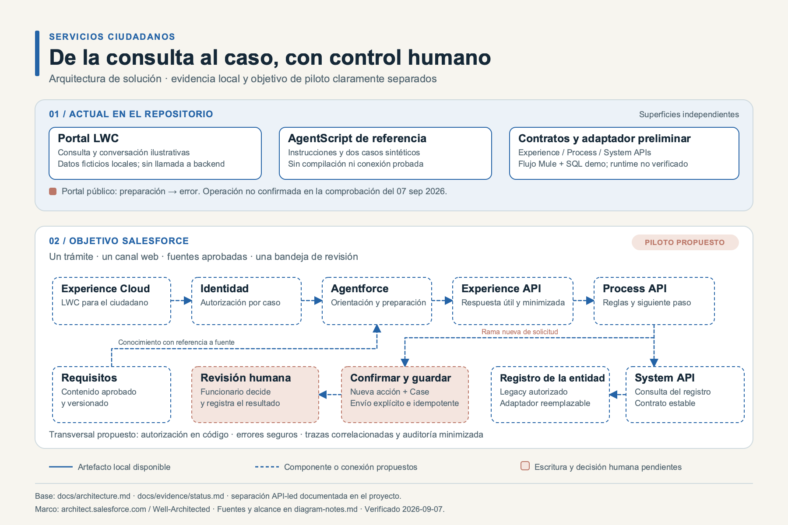
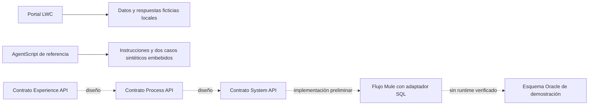
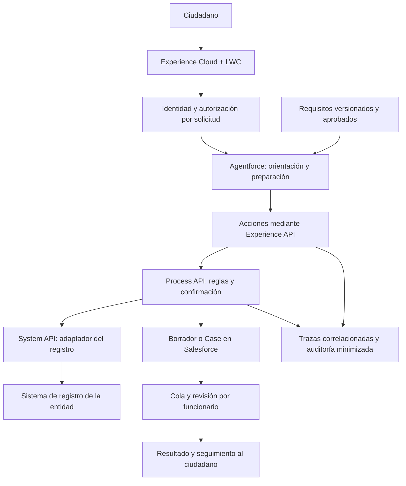

# Arquitectura: estado actual y objetivo

[Diagrama editable](visuals/solution-architecture.svg) · [Revisión Well-Architected](visuals/well-architected.png) · [Notas y fuentes](visuals/diagram-notes.md)

## Estado actual en el repositorio

Las líneas discontinuas representan contratos o conexiones propuestas. El LWC no importa Apex ni ejecuta llamadas HTTP. El botón del asistente cambia un mensaje local; no abre una sesión Agentforce. El AgentScript heredado contiene un escenario separado de demostración y no documenta una invocación real a los contratos.

La exportación del sitio Experience Cloud completo y los vínculos generados de la organización anterior se excluyeron. `force-app` contiene únicamente el componente propio seleccionable; no permite recrear por sí solo un sitio publicado.

## Objetivo para un piloto Salesforce

Esta vista es una propuesta; las piezas de escritura, autenticación y revisión no están implementadas. No requiere migrar a AWS. La selección de capacidades de Agentforce, acciones, objetos, licencias, canal y mecanismos de integración se valida en la organización del piloto antes de cerrar su alcance.

## Responsabilidades y límites

| Capa | Responsabilidad | Evidencia actual |
|---|---|---|
| Experience Cloud/LWC | Explicar el recorrido y capturar entrada | Componente local; publicación histórica documentada en origen |
| Agentforce | Orientar, pedir aclaración y preparar derivación | Referencia de instrucciones; pruebas históricas del origen, no repetidas aquí |
| Experience API | Exponer mensajes y campos adecuados al canal | Contrato OpenAPI |
| Process API | Reglas reutilizables, próximo paso y señal de derivación | Contrato OpenAPI |
| System API | Lectura del registro mediante contrato estable | Contrato y flujo preliminar |
| Escritura y revisión | Confirmación, idempotencia, propietario y resolución humana | Diseño pendiente |

El identificador de caso nunca sustituye una autorización. El adaptador debe comprobar que el solicitante autenticado puede consultar ese caso antes de devolverlo. La coincidencia local del caso ficticio solo es una interacción de demostración.

Los contratos actuales cubren **consulta**. La creación de solicitud exige un contrato adicional y un diseño de idempotencia y estados; no debe improvisarse como una herramienta con acceso libre al objeto `Case`.

Oracle representa aquí un sistema legacy de demostración. No es un requisito para una nueva entidad: el adaptador puede apuntar a un sistema autorizado conservando el contrato de negocio. La compatibilidad del conector y runtime se verifica para ese destino.

## Decisiones por cerrar con la entidad

- Trámite, fuente oficial, actualización y responsable del contenido.
- Inicio de sesión, acceso a cada caso y datos permitidos por canal.
- Objeto de solicitud, estados y equipo que recibirá la derivación.
- Retención, correlación y acceso a trazas sin exponer conversaciones completas.
- Licencias, versiones, región, límites y costo del piloto, validados para su organización.
